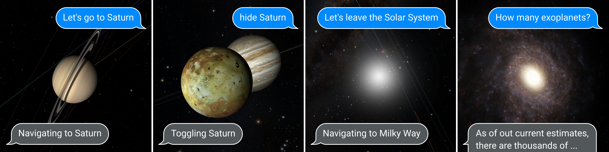

# OpenSpaceGuide: steering OpenSpace with natural language

---

This repo contains a script for piloting an [OpenSpace](https://github.com/OpenSpace/OpenSpace/) instance with OpenAI's GPT4 and Whisper.
More details about this project on OSF — [https://osf.io/jcgzt/](https://osf.io/jcgzt/)

## Instructions

 * Install the Python dependencies — `pip install -R requirements.txt` (it's recommended to setup a virtual environment first, see [this](https://virtualenv.pypa.io/en/latest/user_guide.html)).
 * Install OpenSpace — [this fork](https://github.com/k2d222/OpenSpace) contains a patch to display the text prompts on screen with `--text-widget`. Otherwise, install from [the main repo](https://github.com/OpenSpace/OpenSpace/).
 * Launch OpenSpace, then start the script (`python main.py --input keyboard`).

## CLI reference
 * `--address <addr>`, `--port <port>`, `--password <pwd>`: OpenSpace server configuration. Default values will work for a locally running instance.
 * `--input <keyboard|speech>`: `keyboard` or `speech`. Whether to use a text input in the console or speech through the microphone via Whisper.
 * `--trigger <key>`: Set this to use a key press to start/stop listening (if `--input` is `speech`). Otherwise, it listens continuously.`
 * `--microphone <index>`: Microphone index to use. Run once to see the list.
 * `--text-widget`: Display prompts and responses in OpenSpace (requires using [the fork](https://github.com/k2d222/OpenSpace))
 * `--targets <comma,separated,list>`: List of OpenSpace targets (Scene Identifiers) that the LLM should be aware of. Defaults to all visible renderables when the script is started.

## Acknowledgements

This work is supported by the Knut and Alice Wallenberg Foundation (KAW 2019.0024), the Marcus and Amalia Wallenberg Foundation (MAW 2023.0130), and efforts from [Visualiseringscenter C](https://visualiseringscenter.se/) (Norrköping, Sweden).
